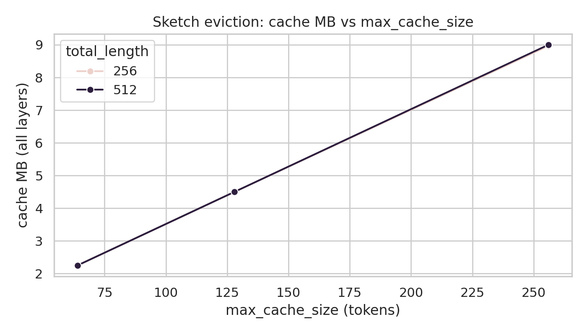
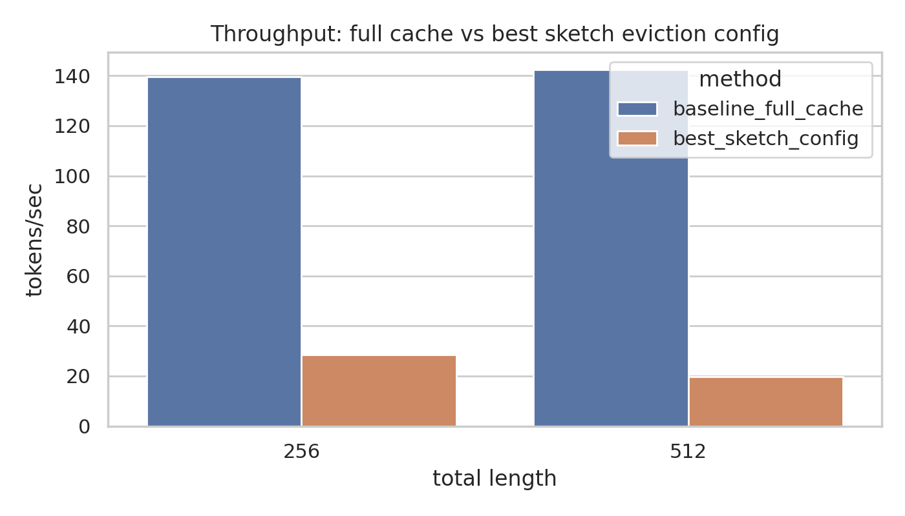
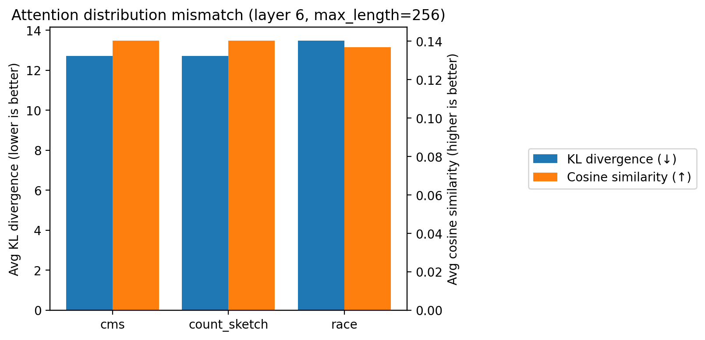

## Probabilistic Sketching for KV-Cache Compression in LLMs (Final Report)

**Team members**: Jay Fu, Gabriel Alvarado

**NETIDs**: **[jlf10]**, **[gaa6]**

### 1) Problem description (1–2 paragraphs)

Transformer autoregressive inference relies on a key–value (KV) cache: for each layer and attention head, the model stores past keys/values so each new token can attend to prior tokens without recomputing old hidden states. The KV cache grows linearly with sequence length, which increases GPU memory consumption and makes attention more expensive as contexts get longer.

This project explores whether *probabilistic sketches* can be used to **compress the effective KV cache** by retaining only a bounded number of “important” past tokens (eviction), and whether sketch-driven approximations preserve attention behavior well enough to be useful. Concretely, we implement sketch-backed importance scoring inside GPT-2 generation and evaluate memory/latency/throughput trade-offs, plus a targeted attention-distribution mismatch analysis.

### 2) Literature survey (1–3 paragraphs)

**Use case 1 (KV-cache compression via eviction/retention):** A common baseline is a **sliding-window** KV cache that keeps only the most recent tokens; this is simple and bounds memory, but can drop long-range dependencies. More selective approaches perform **attention/importance-based eviction**, keeping a subset of tokens deemed important by recent attention scores or token salience; these methods aim to preserve older-but-relevant context while still bounding cache growth.

**Use case 2 (approximate representations / approximate attention):** Another line of work compresses KV state without removing tokens using **KV-cache quantization** (e.g., storing keys/values at 8-bit or lower precision) to reduce memory bandwidth and footprint while maintaining accuracy. Separately, **sparse/long-context attention** methods (e.g., block sparse patterns, top-k attention) approximate full attention by restricting which tokens are attended to, trading exactness for efficiency.

### 3) Hypothesis / argument (one bold sentence per use case)

- **Use case 1 hypothesis:** **If we cap the KV cache to a fixed maximum size and use sketch-based importance scores to choose which tokens to retain, then KV-cache memory will scale with the cap while maintaining a usable throughput for generation.**
- **Use case 2 hypothesis:** **If sketches preserve the relative “importance” structure of tokens, then the resulting attention distributions will remain close to the full-cache attention distribution (low KL divergence, higher cosine similarity).**

### 4) Experimental settings (2–5 paragraphs per use case)

**Use case 1: sketch-assisted eviction (bounded KV cache).** We evaluate GPT-2 (`gpt2`, Hugging Face Transformers) on the WikiText-2 raw test split (`wikitext-2-raw-v1`). For each sample, we truncate the prompt to the first 50 tokens and then generate autoregressively until reaching a *total length* target (prompt + generated). We run on a CUDA device with FP16 weights when CUDA is available. Baseline full-cache runs use `experiments/baseline.py`, which generates tokens one-at-a-time to measure **peak GPU memory (MB)**, **latency per generated token (ms/token)**, and **throughput (tokens/sec)**, and computes **perplexity** on a small subset.

For sketch-based eviction, we run targeted grids from `results/` produced by `experiments/sketch_experiments.py`. Each configuration specifies a sketch type (in the “full targeted” grid), sketch width/depth, and an eviction policy controlled by `max_cache_size` (the maximum number of tokens retained per layer). We report: **(a)** `cache_memory_mb` (KV cache memory, aggregated across layers), **(b)** `avg_memory_mb` (overall peak memory including model weights and other overheads), and **(c)** `avg_latency_s`/`avg_throughput` (end-to-end generation timing as logged by the experiment harness). We also compare against two non-sketch baselines implemented in `experiments/baselines_comparison.py`: a **sliding-window cache** (window 256) and an **int8 KV quantization** proxy, each logged with memory and end-to-end latency.

**Use case 2: attention distribution mismatch analysis.** We quantify how closely the sketch-driven mechanism matches full-cache attention at a fixed layer (layer index 6) using `experiments/attention_analysis.py`. The experiment computes divergence/similarity between the *reference* attention distribution and the sketch-induced distribution using **KL divergence** (lower is better), **cosine similarity** (higher is better), plus L1/L2 distances and peak-position differences. `results/attention_analysis_targeted_types/analysis_summary.json` reports averages over `num_samples=2` with `warmup_tokens=64`, `stride=16`, and `max_length=256`, using `sketch_type ∈ {cms, count_sketch, race}` with `sketch_width=512`, `sketch_depth=4`, and `topk=64`.

In this setting, the “reference” attention distribution is computed from the unmodified attention mechanism over the available context, while the sketch-driven variant produces a distribution induced by the sketch-based token selection/importance mechanism under the same prompt stream. We treat this as a diagnostic metric (not a direct downstream quality metric): it is intended to reveal whether the sketch configuration preserves attention structure, and to help interpret why some sketch settings may be slower or less faithful than others.

### 5) Plots + results summary (1–2 paragraphs per use case)

**Use case 1 results (bounded KV cache).** The capped-cache mechanism behaves as intended: KV cache memory scales with the cap. For example, in the targeted sketch runs, `cache_memory_mb` is **2.25 MB** at `max_cache_size=64`, **4.50 MB** at `max_cache_size=128`, and **≈9.0 MB** at `max_cache_size=256` (for both total lengths 256 and 512), demonstrating an explicit memory knob on KV storage. This is visualized in the plot below.

However, overall `avg_memory_mb` remains close to the full-cache baseline (because model weights dominate), and our sketch-based configurations introduce substantial runtime overhead in end-to-end generation (throughput drops from the baseline’s ~140 tokens/sec in the per-token measurement harness to ~15–28 tokens/sec in the sketch experiment harness, depending on configuration). For additional context, the comparison baselines logged in `results/baselines/comparison_summary.json` show that (at total length 512) a sliding-window cache (window 256) and an int8-quantization proxy have similar peak memory (**287.18 MB** vs **284.55 MB**) and similar end-to-end latency (**3.90 s** vs **3.80 s**) in that harness; these baselines do not reduce memory nearly as much as a strict KV cap, but also avoid the more expensive per-step sketch scoring used in our eviction prototype. The throughput trend vs `max_cache_size` and a baseline-vs-best-sketch comparison are shown below.

**Use case 2 results (attention mismatch).** On the targeted attention analysis, all three sketch types show **high KL divergence (~12–13)** and **low cosine similarity (~0.14)**, indicating that the sketch-induced attention distribution is not yet a close approximation to the reference attention distribution under this configuration. Differences among `cms`, `count_sketch`, and `race` are small in this measurement (the plot below shows the averaged metrics).

### 6) Conclusion (1 paragraph)

We implemented sketch-backed mechanisms for bounding the KV cache during GPT-2 generation and validated the central **systems claim** of use case 1: KV-cache memory scales directly with the configured cap (`max_cache_size`), as shown by the cache-memory plots in `results/figures/`. At the same time, the current prototype incurs significant end-to-end overhead (reduced throughput), and the targeted attention-analysis results show that the sketch-induced attention distributions remain far from the full-cache distributions in this setup, so the **approximation-quality hypothesis** (use case 2) is not supported by these measurements. Overall, the project demonstrates a working, configurable KV-cache memory knob via sketch-assisted eviction, while highlighting that achieving *both* strong compression *and* low-overhead / faithful attention behavior requires further algorithmic and systems optimization.

---
